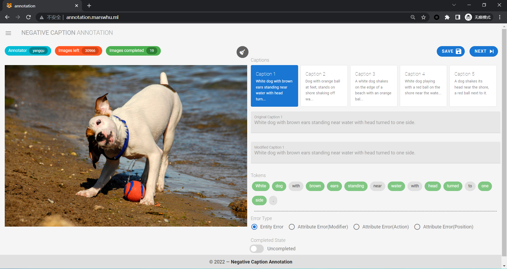
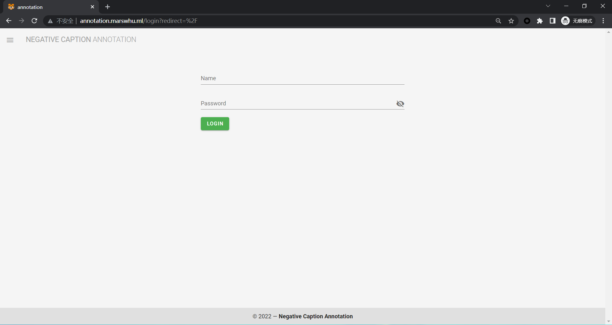

# Dataset-annotation-tool

这是一个对图像与文本中错误的语义匹配信息进行标注的GUI工具。

下面介绍该工具的使用方法。

## 目录

- [使用介绍](#使用介绍)
  - [界面简介](#界面简介)
  - [标注流程](#标注流程)
    - [登录](#登录)
    - [标注](#标注)
  - [标注示例](#标注示例)
- [本地运行](#本地运行)
  - [Prerequisites](#prerequisites)
  - [Compiles and hot-reloads for development](#compiles-and-hot-reloads-for-development)
  - [Compiles and minifies for production](#compiles-and-minifies-for-production)
  - [Lints and fixes files](#lints-and-fixes-files)
  - [Customize configuration](#customize-configuration)
- [鸣谢](#鸣谢)
- [使用许可](#使用许可)

### 使用介绍

#### 界面简介

<div align="center">
  
</div>

标注页面主要由`图像bounding box框选标注区域`与`文本token标注区域`构成，在页面上方还可以查看`标注者的信息`，`剩余图片数量`，`已完成标注图片的数量`，同时还有一些功能按钮。

#### 标注流程

##### 登录

<div align="center">
  
</div>

访问标注网页域名或ip，输入账号名和密码进行登录。

##### 标注

标注操作主要包括`在图像中绘制bounding box`，`修改文本token`以及`勾选该错误的类别`。

下面详细描述各标注操作。
> 注：为方便标注，系统自动识别出了文本中的形容词，动词，名词等实词（用绿色表示），并给出了语义相近的候选词，对文本进行标注也主要是对这些实词做出修改。

|#|描述|演示|
|---|---|----
|1|<span style="display:inline-block;width:130px">**在句子中添加单词**</span>|<a href="https://files.catbox.moe/ud5zw8.gif"></a>
|2|<span style="display:inline-block;width:130px">**在句首添加单词**</span>|[](https://files.catbox.moe/chf155.gif)
|3|<span style="display:inline-block;width:130px">**删除单词**</span>|[](https://files.catbox.moe/i13tdq.gif)
|4|<span style="display:inline-block;width:130px">**更改具有候选词，即绿色单词的状态为negative**（错误的词汇可以选择系统自动生成的候选词，如果觉得在其中没有合适的词汇，也可自行添加，如右图所示）</span>|[](https://files.catbox.moe/i5iinz.gif)
|5|<span style="display:inline-block;width:130px">**更改不具有候选词，即灰色单词的状态为negative**，灰色单词有可能是没有被系统识别出的实词或是标注者在句子中自行添加的词汇，这些情况下更改单词的状态为negative就需要采用右图的形式</span>|[](https://files.catbox.moe/4dkogw.gif)
|6|<span style="display:inline-block;width:130px">**图像bounding box框选**，可以用鼠标对图像的多个区域进行框选标注，右上角的扫帚图标为清除当前图像中的所有bounding box</span>|[](https://files.catbox.moe/39pg41.gif)
|7|<span style="display:inline-block;width:130px">**勾选错误类型**</span>|[](https://files.catbox.moe/6ncqp8.gif)
|8|<span style="display:inline-block;width:130px">**数据保存与获取**，点击Save按钮可以将当前标注的工作内容暂存到服务器上（如果此时关闭网页，下次重新打开网页可以从服务器加载之前的标注工作进度），在对每一个caption都完成`在图像中绘制bounding box`，`修改文本token`以及`勾选该错误的类别`这几项操作后，同时勾选完成状态为已完成（每标注完成一个caption后建议勾选一下，这个的作用可以提醒自己完成了哪些caption，同时也是为了确保完成了所有caption的标注工作），点击Next按钮可以获取下一张图像和文本caption，进行新一轮的标注</span>|[](https://files.catbox.moe/fibsw3.gif)

#### 标注示例

目前暂时将错误类型分为以下四类：
- Entity Error(实体错误)
- Attribute Error(Modifier)(修饰词属性错误)
- Attribute Error(Action)(动作属性错误)
- Attribute Error(Position)(位置属性错误)

下面给出这几种标注的示例：

|#|标注示范|描述|
|---|---|----
|**Entity Error**|[](https://files.catbox.moe/059il9.gif)|<span style="display:inline-block;width:260px">将句中某一实体替换为另一错误实体（一般更改名词），并在图像中框出`相关实体`区域的位置</span>
|**Attribute Error(Modifier)**|[")](https://files.catbox.moe/gy9ep1.gif)|<span style="display:inline-block;width:260px">将句中某一实体的属性改成错误的，包括但不仅限于颜色，数量等（一般更改形容词），并在图像中框出`相关实体`区域的位置</span>
|**Attribute Error(Action)**|[")](https://files.catbox.moe/e88x7u.gif)|<span style="display:inline-block;width:260px">将句中某一实体的动作改成错误的（一般更改动词），并在图像中框出`相关`区域的位置（偏抽象，各人理解不同，框选的区域也会出现差异）</span>
|**Attribute Error(Position)**|[")](https://files.catbox.moe/w1gldy.gif)|<span style="display:inline-block;width:260px">将句中某一实体与另一实体的位置关系更改为错误的（可能涉及到句子结构的更改），并在图像中框出`所有相关实体`区域的位置</span>

> 还有一点需要注意的是，请尽量平衡各错误类型标注的数量比例。一般来说，位置属性错误出现的次数较少，当发现caption中存在对实体间位置的描述时，优先考虑标注Attribute Error(Position)。

### 本地运行

以下内容部分由脚手架工具自动生成，供参考。

#### Prerequisites
```
git clone https://github.com/TongxinWong/dataset-annotation-tool.git
cd dataset-annotation-tool
npm install
```

#### Compiles and hot-reloads for development
```
npm run serve
```

#### Compiles and minifies for production
```
npm run build
```

#### Lints and fixes files
```
npm run lint
```

#### Customize configuration
See [Configuration Reference](https://cli.vuejs.org/config/).

### 鸣谢
- [Vue](https://vuejs.org/)
- [Vuetify](https://vuetifyjs.com/)
- [Qu Yang](https://github.com/chris075966)(`Thanks for offering the cloud server`)

### 使用许可
[MIT](LICENSE) © Tongxin Wang